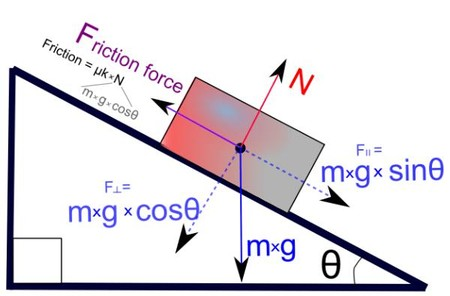
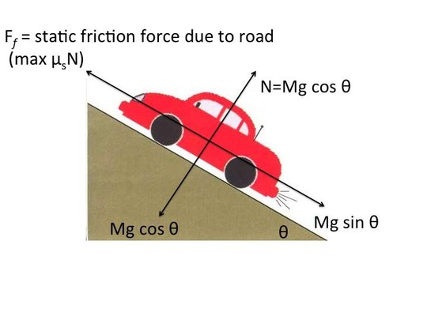
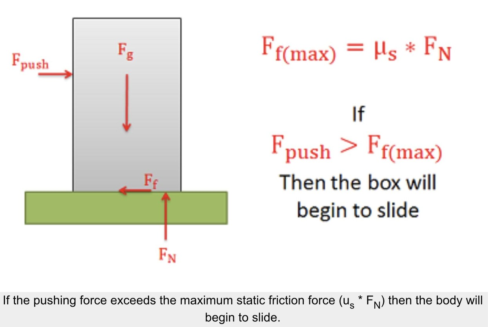
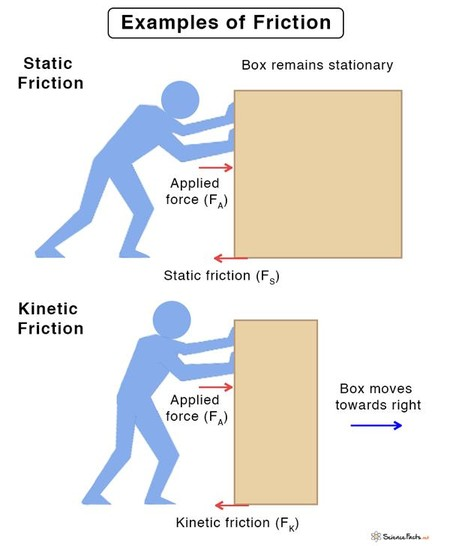
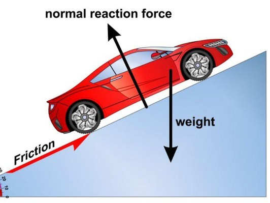

# Friction

For **exam-style physics problems**, the coefficient of static friction ($\mu_s$) is usually taken as a **simple rounded value** so you don’t get bogged down in material science. Examiners expect you to recognise and use these standard approximations:

---

## 🎓 Typical exam assumptions

| Situation (rarely stated in detail) | Assume ($\mu_s$)                     |
|-------------------------------------|--------------------------------------|
| “Rough surface” (generic default)   | **0.5**                              |
| Rubber (e.g. tyres) on road         | **0.7 – 1.0** (often **0.8**)        |
| Wood on wood                        | **0.4**                              |
| Metal on metal                      | **0.5**                              |
| Smooth / slightly slippery          | **0.2 – 0.3**                        |
| Very smooth / icy                   | **0.1** or **0** (if “frictionless”) |

---

## 🧠 How exam questions are designed

* If the problem says **“rough surface”** → take **($\mu_s = 0.5$)** unless told otherwise
* If a value is **important**, it will usually be **given explicitly**
* If it says **“smooth”** → assume **no friction (μ = 0)**
* If friction is **not mentioned**, assume **no friction**

---

## ⚠️ Common pitfalls

* Don’t confuse **static** and **kinetic** friction (exams often use ($\mu_k \approx 0.3$) when needed)
* Maximum static friction is:
  $$
  F_{\text{max}} = \mu_s N
  $$
  — but actual friction can be **less than this**
* On slopes, friction acts **up the slope** if the object tends to slide down

---

If you like, I can give you a few **classic exam problems** (with solutions) to lock this in.
